<html>
<body>
    <h1 >Compte Rendu</h1>
    <ol id="principale">
        <li> Créer l'interface IDao avec une méthode getDate
            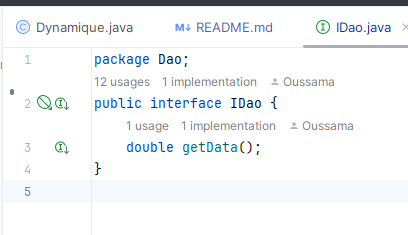
        </li>
        <li> Créer une implémentation de cette interface 
            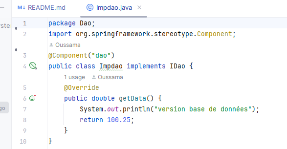
        </li>
        <li> Créer l'interface IMetier avec une méthode calcul
            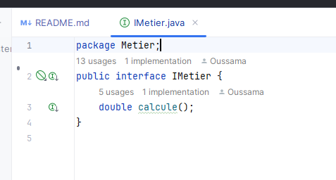
        </li>
        <li> Créer une implémentation de cette interface en utilisant le couplage faible
            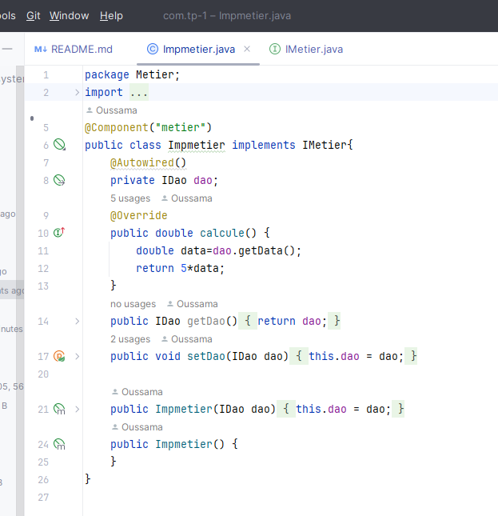
        </li>
        <li >Faire l'injection des dépendances
            <ol id="secondaire">
                <li class="question5"> Par instanciation statique</li>
                    <ol>
                        <li class="q5">Classe presentation statique</li>
                            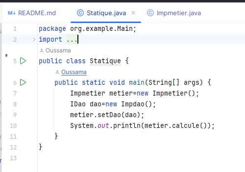
                        <li class="q5"> Execution</li>
                            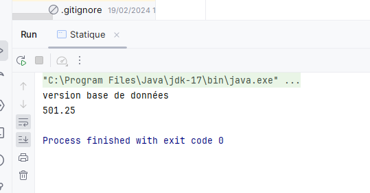
                    </ol>
                <li class="question5"> Par instanciation dynamique</li>
                    <ol>
                        <li class="q5">Classe presentation dynamique</li>
                            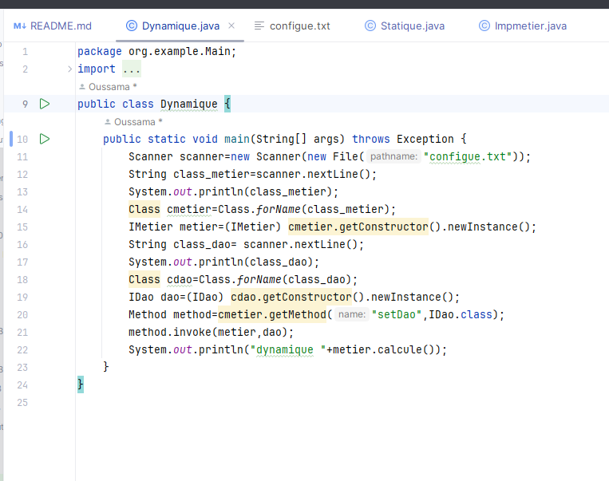
                        <li class="q5"> Execution</li>
                            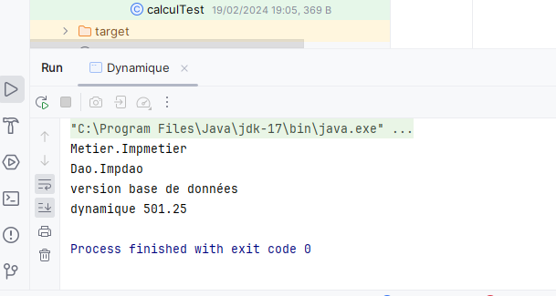
                    </ol>
                <li class="question5"> Version XMl</li>
                    <ol>
                        <li class="q5">Fichier configue.xml </li>
                            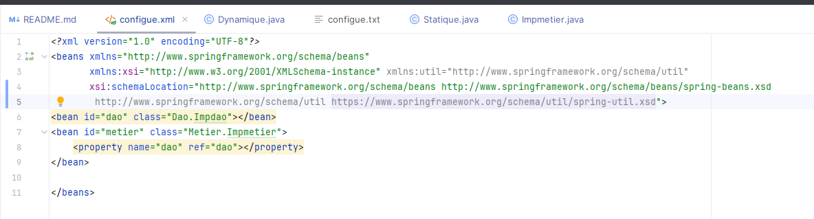
                        <li class="q5"> Presentation Xml</li>
                            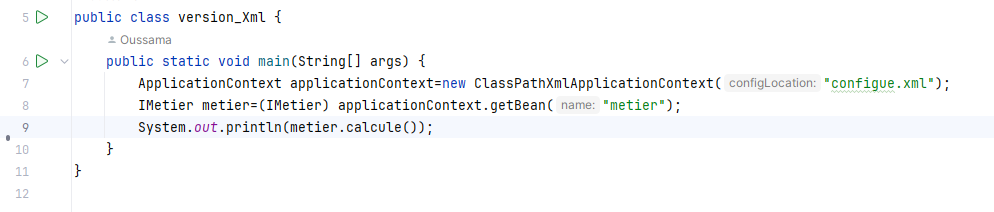
                        <li class="q5"> Execution</li>
                            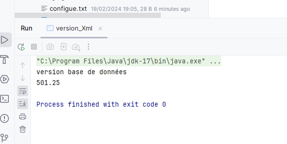
                    </ol>
                <li class="question5"> Version Annotations</li>
                    <ol>
                        <li class="q5">Presentation Annotation </li>
                            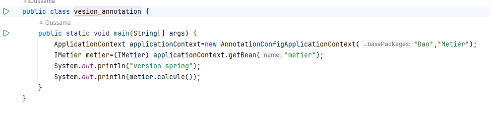
                        <li class="q5"> Classe Xml</li>
                            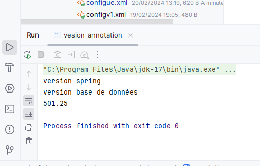
                        </ol>
            </ol>
        </li>
    </ol>

</body>
</html>